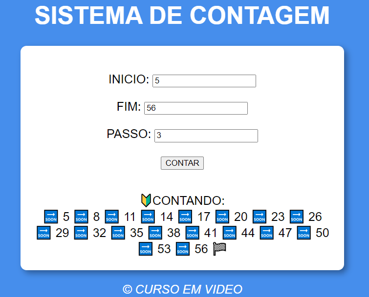

# SISTEMA DE CONTAGEM
👨‍🏫PROJETO FEITO PARA O CURSO DE JAVASCRIPT DO CURSO EM VIDEO.

 <br>

## DESCRIÇÃO:
O objetivo deste projeto é fornecer um sistema simples de contagem, permitindo que os usuários contem de um número inicial até um número final, com um intervalo definido.

1. **Inserir Dados:**
   - Permite aos usuários inserir um número inicial, um número final e um passo (intervalo) para a contagem.

2. **Contar:**
   - Ao clicar no botão "CONTAR", o sistema realizará a contagem a partir do número inicial até o número final, respeitando o passo definido.

3. **Validação de Dados:**
   - Verifica se todos os campos foram preenchidos antes de iniciar a contagem.
   - Se o passo for menor ou igual a zero, será considerado como 1.

### EXECUTANDO O PROJETO:
1. **Inserir os Dados:**
   - Digite o número inicial desejado no campo "INÍCIO".
   - Digite o número final desejado no campo "FIM".
   - Digite o passo (intervalo) desejado no campo "PASSO".

2. **Contar:**
   - Clique no botão "CONTAR" para iniciar a contagem.

## COMO USAR?
### BAIXANDO O PROJETO:
* Clone o repositório para o seu sistema local:

```bash
git clone https://github.com/VILHALVA/SISTEMA-DE-CONTAGEM.git
```

* Navegue até o diretório do projeto.

```bash
cd SISTEMA-DE-CONTAGEM
```

* Descompacte o arquivo ZIP (se você baixou manualmente):

```bash
unzip SISTEMA-DE-CONTAGEM.zip
```
* Abra o arquivo `CODIGO.html` em seu navegador de preferência.

### EXECUTANDO O PROJETO:
1. **Adicionar Números:**
   - Insira um número entre 1 e 100 no campo de entrada.
   - Clique em "ADICIONAR" para adicionar o número à lista.

2. **Finalizar Análise:**
   - Após adicionar os números desejados, clique em "FINALIZAR" para realizar a análise.
   - Serão exibidas informações sobre os números adicionados, incluindo o total, o maior valor, o menor valor, a soma e a média.

## NÃO SABE?
- Entendemos que para manipular arquivos em `HTML`, `CSS` e outras linguagens relacionadas, é necessário possuir conhecimento nessas áreas. Para auxiliar nesse aprendizado, oferecemos cursos gratuitos disponíveis:
* [Curso de HTML e CSS](https://github.com/VILHALVA/CURSO-DE-HTML-E-CSS)
* [Curso de JavaScript](https://github.com/VILHALVA/CURSO-DE-JAVASCRIPT)
* [Confira mais cursos](https://github.com/VILHALVA?tab=repositories&q=+topic:CURSO)

## CREDITOS:
- [PROJETO FEITO PELO VILHALVA](https://github.com/VILHALVA)
- [PROJETO FEITO PARA O CURSO DE JAVASCRIPT](https://github.com/VILHALVA/CURSO-DE-JAVASCRIPT)
- [ESTÁ DISPONIVEL NO SITE](https://vilhalva.github.io/STYLER/STYLER.html)
